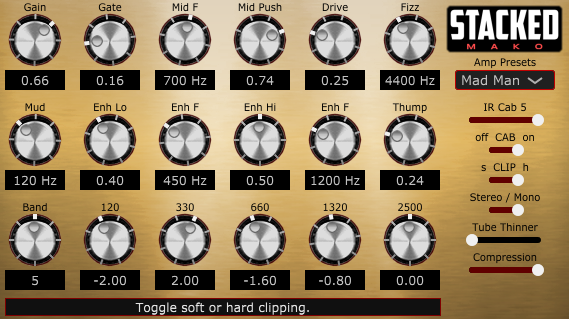

# Mako STACKED
* JUCE VST3 Guitar Amp Sim.
* Demo JUCE program.
* Tested on Windows only.
* Written in Visual C++ 2022.
* Written for new programmers, not complicated.
* Version: 1.10
* Posted: June 3, 2024

VERSION
------------------------------------------------------------------
1.00 - Initial release.

DISCLAIMER
------------------------------------------------------------------  
This VST was written in a very simple way. No object defs, etc. 
Just simple code for people who are not programmers but want to 
dabble in the magic of JUCE VSTs.

If you are new to JUCE code, the Mako Thump VST may be a better
starting place. Or be brave and try this.
       
SUMMARY
------------------------------------------------------------------
A Juce/C++ VST3 written to simulate a guitar amplifier. 

# THEORY OF OPERATION 
This VST is designed to mimic a medium gain amplifier. It uses
a typical OverDrive/Distortion pedal technique of passing the
guitar signal into a 700 Hz Band Pass filter and then distorting
the signal.  

The band pass filter frequency and bandwidth value (Q) are
adjustable. 

ENHANCE 
There are also three additional gain adjust stages:
- Enhance High, adds distorted high freqs before the gain stage.
- Enhance Low, adds distortion thickness after the gain stage.
- Thump, add low freq distortion to mimic speaker cab/compression.

5 BAND EQ 
There are also 10 predefined 5 band EQs available.

LOW PASS (FIZZ) AND HIGH PASS (MUD) FILTERS 
As you add gain, you may want to remove bass from the signal. Use the MUD High Pass 
filter for this. Low gain is fine at 50 Hz and super high gain may require 150-180 Hz.  

As you add gain, you will also add high frequency harmonics. Harmonics are multiples of
the original signal. If you distort 1 kHz, you will also get the odd harmonics 3 Khz,
5 kHz, etc to infinity. These harmincs sound like a 'fizz' sound and can be very harsh.
Use the LOW PASS (FIZZ) filter to reduce these high frequency harmonics.  
  
It is sometimes better to over do the FIZZ filter and then add some high freqs back using the EQ.
This gives you better control of the freqs you want to hear. typical guitar speakers start to roll
the high freqs at around 5 kHz. So FIZZ values of 3 kHz and up are normal. Then add specific highs
back using the 5 band EQ. Or load the code and do whatever you want! That is the point of all this.
  
IMPULSE RESPONSE 
There is also an Impulse Response section, to add a realistic
speaker response. IRs are typically WAVE files 1024 or 2048 samples
in length. For simplification, the IRs used here are stored in 
code as float arrays. There are 5 IRs available.

IRs are very CPU heavy. For best results an IR of sample size 2048 should be used.
This VST uses 1024 based IRs to keep CPU usage low. A slider could be added to 
reduce the sample size even further, at the cost of fidelity. Larger IRs have more
accurate low frequency information. But remember, a full frequency flat response IR is a single sample.
So get creative.

COMPRESSOR 
The program also adds a pre gain compressor stage. This can help get a fatter tone in certain instances.

TUBE THINNER 
This hack tries to reduce the guitar signal volume when driving hard into the clipping stages.
It should only be used when soloing if you are hearing ghost notes and alien sounds. Since we are
applying a lot of gain, we will start to hear random noises that are normally at the noise floor
of your guitar signal. The thinner tries to reduce your volume between note peaks to reduce these
weird noises.

CLIPPING 
The backbone of a distorted sound is the clipping stage. This is the magic place where people
feel tubes amps excel. We have two types of clipping in this VST, Hard and Soft. Hard does exactly
what it says. Any signal above 1.0 is clipped to 1.0. The soft method uses a hypertangent function.
This function creates a soft curve that limits the signal from -1.0 to 1.0. 

If you want to create the next best VST, this is where you want to start editing the code.

STEREO/MONO 
When in MONO mode, the VST uses the LEFT (Channel 0) channel for calculations. The audio is then
copied to the right channel. In stereo mode, all calculations are done twice. Once for each channel. 
This is expensive on CPU usage. Run Mono when possible for best results.

# FINAL THOUGHTS 
The bones of an amplifier are here. Adjusting filter Q values and frequencies is one thing to play with.
Another thing to try is where EQ is applied.  

High gain amps have EQ before the gain stage. Because any low freqs will overwhelm the distortion stage.
This is how a FUZZ pedal works. So a certain amps EQ style and EQ position can determine how that amp sounds.
  
This VST is designed to be a sort of tool chest or playground for you to figure things out, play, and have fun.

